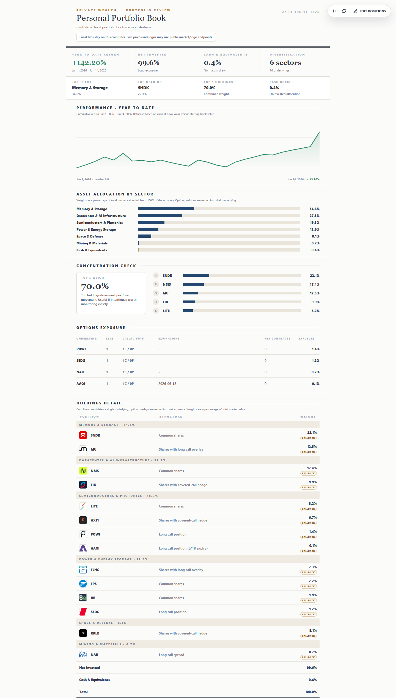

# Portfolio Review Local

A local-first investment portfolio review dashboard powered by editable CSV and JSON files.

It helps you review public-market holdings, cash, sector/theme allocation, concentration risk,
options exposure, live/fallback price status, and performance without a database, account system, or
hosted backend.



## Why Use This

- Runs on your computer.
- Stores your working portfolio files in ignored local `data/` files.
- Starts from fictional demo data, a blank book, or a pasted positions CSV.
- Keeps private dollar values hidden by default behind the eye icon.
- Uses editable files instead of a brokerage login or cloud database.
- Works with common stock rows, option rows, spreads, cash, fallback market values, and optional
  benchmark performance data.

Using Claude Code or another coding agent? See [AGENTS.md](AGENTS.md) for agent-oriented setup and
local run instructions.

## Quick Start

From the project folder:

```bash
npm run local
```

Then open:

```text
http://127.0.0.1:8787
```

`npm run local` installs dependencies, builds the frontend, and starts the local Node server.

On first run, choose one of:

- `Use Demo Data`: copy the fictional sample investment portfolio from `demo-data/sample`.
- `Start Blank`: create empty local CSV/JSON files.
- `Import CSV`: initialize from pasted `positions.csv` contents.

After setup, use `Edit Positions` and the `Reset local files` actions to back up your current files
and either start blank or reload the demo portfolio. Reset actions require typed confirmation before
anything is replaced.

On Windows, `run-local.ps1` runs the same one-command local startup.

## What The Dashboard Shows

- Year-to-date portfolio return.
- Net invested and cash allocation.
- Sector/theme allocation.
- Top holding and top-five concentration.
- Options exposure by underlying.
- Holdings grouped by underlying ticker.
- Live, fallback, or missing price status.
- Optional benchmark line on the performance chart.

## Local Data Files

Your working files live in `data/` and are ignored by Git:

```text
data/positions.csv
data/settings.json
data/performance.csv
data/logos/
data/backups/
```

The repo ships demo data in `demo-data/sample`. Your personal edits stay in `data/` unless you
deliberately share them.

When you save from the in-app editor, the server writes timestamped backups to `data/backups/`.
Resetting to blank or demo data also creates backups before replacing local files.

## Privacy Model

- There is no account system, hosted backend, or cloud database.
- The local server may contact public market/logo endpoints for live prices and company logos.
- Cached logos, backups, and edited CSV/JSON files remain local.
- Private dollar amounts are hidden in the report until you click the eye icon.

## Editing Positions

Use `Edit Positions` in the top-right controls. Saving writes to:

```text
data/positions.csv
data/settings.json
```

The report intentionally emphasizes percentages. The editor includes account total value because the
app needs it to calculate position weights and leftover cash.

`data/settings.json` also includes `benchmarkName` and `benchmarkTicker`, which label the dashed
benchmark line when `data/performance.csv` includes benchmark returns. If no ticker is set, the app
falls back to `SPY` for an S&P 500 benchmark label.

## CSV Shape

`data/positions.csv` supports these columns:

| Column | Meaning |
| --- | --- |
| `ticker` | Visible ticker in the report. |
| `company` | Company name for labels and logo alt text. |
| `underlying` | Stock ticker that option rows net into. |
| `assetType` | `stock`, `option`, or `spread`. |
| `side` | `long` adds exposure; `short` subtracts exposure. |
| `quantity` | Shares for stock rows, contracts for option rows. |
| `averageCost` | Average cost per share or contract. |
| `multiplier` | Leave blank for defaults: `1` for stock, `100` for options. |
| `marketValue` | Fallback value used when quantity is blank or live prices are unavailable. |
| `optionType` | `call` or `put` for option rows. |
| `strikePrice` | Option strike price. |
| `expiryDate` | Option expiration date. |
| `premium` | Option premium or cost basis, depending on how you track it. |
| `sector` | Sector or theme bucket. |
| `structure` | Report wording, such as `Common shares` or `Shares with covered-call hedge`. |
| `logoUrl` | Company logo URL. |

## Performance And Benchmarks

`data/performance.csv` supports:

| Column | Meaning |
| --- | --- |
| `date` | Chart point date in `YYYY-MM-DD` format. |
| `returnPct` | Portfolio cumulative return percentage for that date. |
| `benchmarkReturnPct` | Optional benchmark cumulative return percentage for that date. |

If `benchmarkReturnPct` is present for more than one row, the performance chart displays a dashed
benchmark line labeled by `benchmarkName` and `benchmarkTicker` from `data/settings.json`. If
benchmark returns are missing or blank, the chart shows only the portfolio line. `benchmarkTicker`
defaults to `SPY` when omitted.

## Prices And Logos

Prices:

- The server first tries public quote endpoints.
- Successful prices are cached in memory for about 10 minutes.
- Holdings with quantity use live prices when available.
- Rows without usable live prices fall back to `marketValue`.

Logos:

- The browser loads logos from local routes such as `/api/logo/SNDK`.
- The server tries `logoUrl`, then favicon fallbacks from the same domain.
- Successful images are cached under `data/logos`.
- If no logo is found, the report shows ticker initials instead of a broken image.

## Validate Changes

Before opening a PR or sharing changes:

```bash
npm run check
```

This runs linting, TypeScript typechecking, the Node test suite, and the production build.

## Release ZIPs

When GitHub Releases are available, non-developers should download the release ZIP from the
repository's Releases page. Release ZIPs include source code, sample data, setup docs, and the
package lockfile.

Release ZIPs exclude:

- `node_modules`
- `dist`
- private local working data from `data/`

Maintainers can build the same source ZIP locally:

```bash
npm run release:zip
```

The generated ZIP is written to `release/`.

## License

MIT. See [LICENSE](LICENSE).
